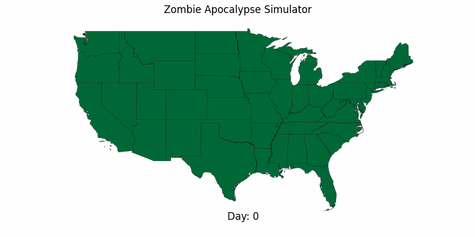

# zed-apoc-sim
Hobby project of simulating a zombie apocalypse in the United States

## Quick Start
`python -m virtualenv venv`

`source venv/bin/activate (on Linux) OR venv\Scripts\activate (on Windows)`

`pip install -r requirements.txt`

`python .\main.py`

`>>run`
### Runtime instructions
<pre>
usage: Simulator Settings [-days [DAYS]] [-duration DURATION] [-echo] [-frame FRAME] [-fps FPS] [-help] [-image] [-load]
                          [-region REGION [REGION ...]] [-resolution {county,state}] [-run] [-size SIZE] [-video] [-viz]
                          [-quit]

Commands

options:
  -days [DAYS]          Number of days to simulate
  -duration DURATION    Duration of the video
  -echo                 Echo settings to screen
  -frame FRAME          Frames to show
  -fps FPS              Frames per second
  -help                 Show this help message
  -image                Make and show image
  -load                 Load the last simulation run
  -region REGION [REGION ...]
                        Region(s) where outbreak starts
  -resolution {county,state}
                        Resolution of 'state'(default) or 'county'
  -run                  Run simulation and visualization
  -size SIZE            Number of zeds to start with. Enter a number bewteen 0-1 to make the start a fraction of the existing population
  -video                Make and save video
  -viz                  Run visualization using previous simulation
  -quit                 Quit the program
  </pre>