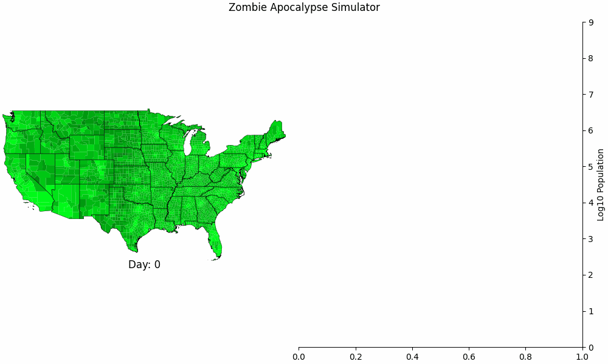

# Scenarios

## Scenario 0 - Test Run

Simulation of a large outbreak in California, simulated at state resolution.

## Scenario 1 - *Night of the Living Dead (1968)*

Simulation of the original modern zombie movie, *Night of the Living Dead.* The outbreak starts in rural Pennsylvania / Ohio where 0.013% of the population, i.e. the recently deceased, are the original, slow-moving zeds.

## Scenario 2 - *Dawn of the Dead (2004)*

Simulation of the modern, modern zombie movie, the *Dawn of the Dead* remake. This simulation starts with a single patient zero in Milwaukee, WI with a much faster, harder-to-escape zed. 

## Scenario 3 - *The Walking Dead (2010)*

This simulation is similar to Scenario 1 except the outbreak starts across the entire Unites States, as the entire population has already been infected.

## Simulation Parameters

| Scenario | Resolution | Outbreak Region | Outbreak Size | Average zed speed (mph) | Simulation Length (days) |
|---|---|---|---|---|---|
| 0 | State | CA | 1,000 zeds | 4 | 365 |
| 1 | County | Beaver PA, Butler PA, Green PA, Lawrence PA, Washington PA, Columbiana, OH | 0.013% of the population | 1.5 | 730 |
| 2 | County | Milwaukee, WI | 1 zed | 8 | 730 |
| 3 | County | United States | 1 zed | 0.0102% of the population | 730 |